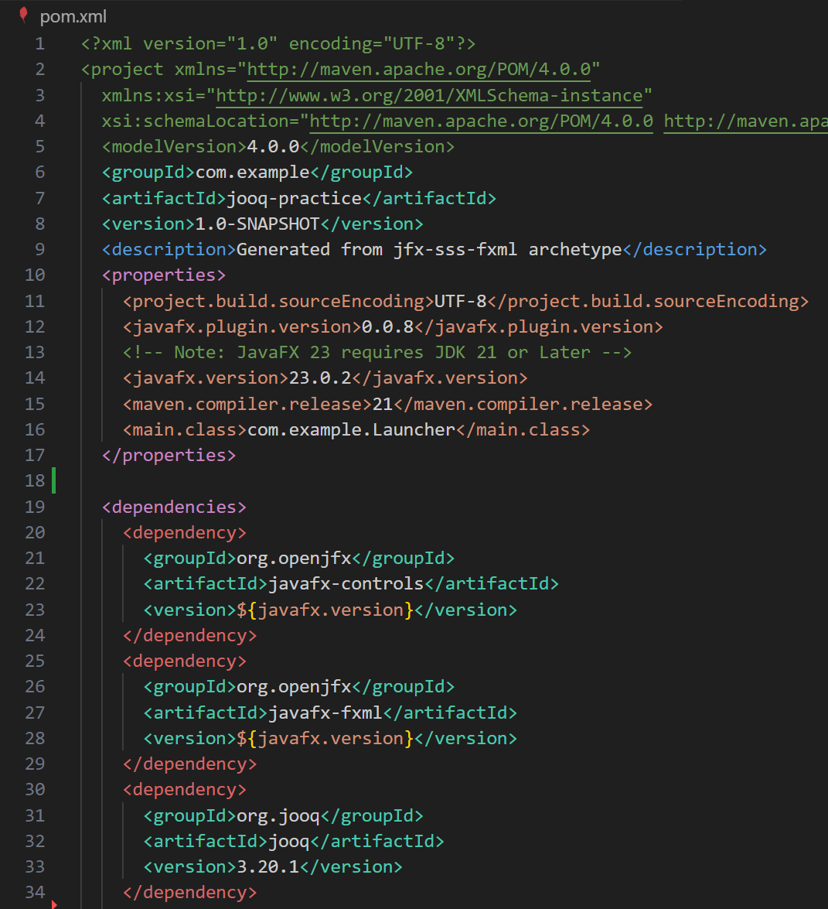
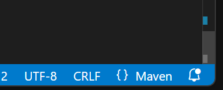

# Maven Language Mode

Highlighter & Formatter for pom.xml 

## Highlighter

If you want to use a dedicated highlighter for pom.xml, install the ["Theme by language"](https://marketplace.visualstudio.com/items?itemName=jsaulou.theme-by-language) plugin to avoid affecting other files.

1. Install the ["Theme by Language"](https://marketplace.visualstudio.com/items?itemName=jsaulou.theme-by-language) plugin.

2. Open your settings.json and add the following entry:

```
"theme-by-language.themes": {
    "maven": "Maven XML"
}
```

3. Open the command palette (Ctrl (Cmd) + Shift + P) and type "Set Default Theme" to select your default theme.

With this setup, the Maven-specific theme will apply only to pom.xml, while the default theme will apply to other files.




## Maven Language Mode

When you open a pom.xml file, it automatically switches to Maven Language Mode.

You can use an XML formatter specifically designed for Maven.


